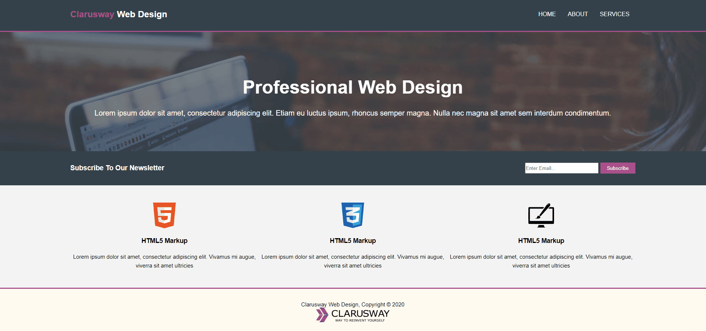

# Web Page 07
<h3>visit: https://aokmen.github.io/Web_Page_07</h3>

# Description:

## This code is an HTML document that represents a web page structure. Here's a breakdown of what each section does:
---
* The nav element represents the navigation section of the webpage. It contains a logo and a menu with links to different pages (HOME, ABOUT, SERVICES).
* The main element contains the main content of the webpage. It consists of a heading ("Professional Web Design") and a paragraph of text.
* The section class="section-email" represents a section for users to subscribe to a newsletter. It contains a heading and a form with an input field and a subscribe button.
* The section class="section-icons" represents a section that showcases different services or features of the website. It contains three boxes with images, headings, and descriptions.
* The footer element represents the footer section of the webpage. It contains a copyright notice and a logo.
The CSS styles that follow the HTML code provide the visual design and layout for the webpage. Here's a summary of the CSS styles applied:
---
* The * selector sets a common style for all elements, including font-family, box-sizing, list-style, margin, and padding.
* The nav styles define the appearance of the navigation bar, including its background color, height, and alignment.
* The .menu and .menu-right styles define the layout and alignment of the navigation menu items.
* The .main-container styles set the width, margin, and text alignment for the main content container.
* The .section-email styles define the background color and layout for the email subscription section.
* The .section-icons styles set the background color and alignment for the section showcasing different services or features.
* The footer and .footer-div styles define the appearance and alignment of the footer section.
* There are additional styles for other sections, such as .main-about and .main-services, which are not included in the provided code snippet.
* Overall, this code creates a basic webpage structure with a navigation bar, main content section, subscription section, service showcase section, and a footer. The CSS styles are used to define the visual design and layout of these sections.
